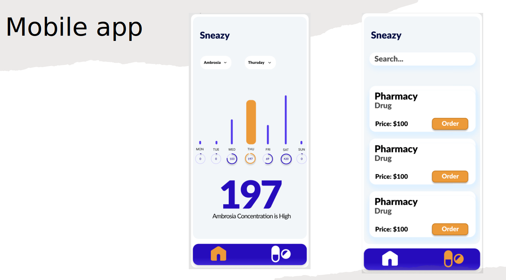
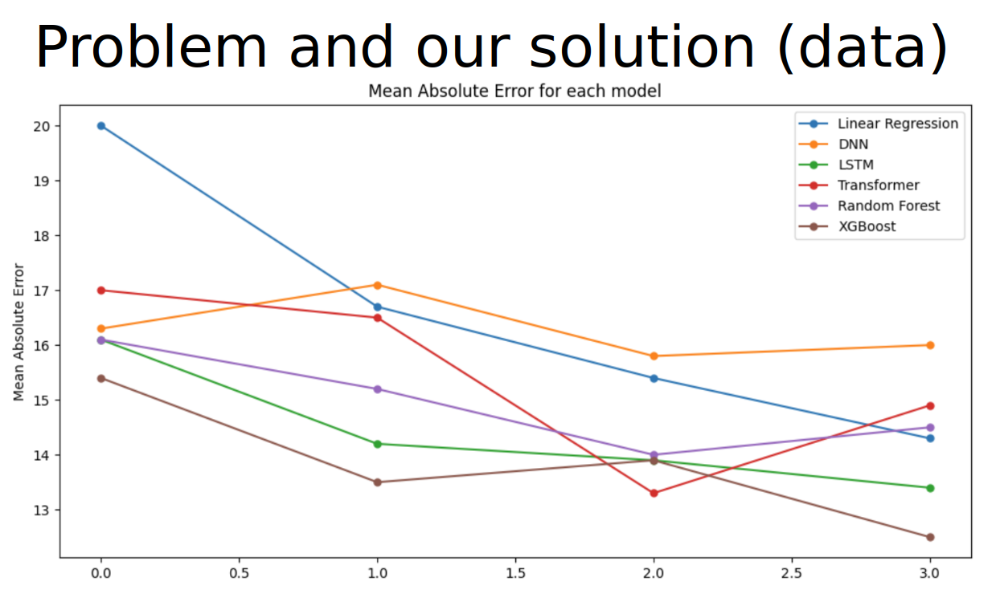

# **Hackathon - 3rd Place**

## Overview

This project was developed for a hackathon, where our team secured the 3rd place. The application aims to provide users with pollen forecasts for their city for the next three days. Predictions are generated using various models, and the application is monetized through advertisements.

## Business Idea

The application serves as a useful tool for individuals who are affected by pollen allergies. It provides accurate and timely predictions about pollen levels, allowing users to manage their symptoms effectively.

### Features

- **Pollen Forecasting:** Predicts pollen levels for the next three days in the user's city using multiple models.
- **Location-Based Predictions:** Provides forecasts specific to the user's city.
- **Ad-Supported:** Generates revenue through ads displayed within the app.

## How It Works

1. **Data Collection:** Collects pollen data and other relevant information required for predictions.
2. **Model Training:** Utilizes various models to generate accurate pollen forecasts.
3. **User Interface:** Displays the forecasts in an easy-to-understand format.
4. **Monetization:** Incorporates advertisements to generate revenue.

## How to Run the Application

### Prerequisites

- Python 3.x
- Necessary Python libraries (listed in `requirements.txt`)

### Installation

1. **Clone the Repository:**

    ```bash
    git clone https://github.com/your-repo/hackathon-3rd-place.git
    cd hackathon-3rd-place
    ```

2. **Install Dependencies:**

    ```bash
    pip install -r requirements.txt
    ```

3. **Run the Application:**

    ```bash
    python main.py
    ```

### Jupyter Notebook

The Jupyter notebook `main.ipynb` contains the different models used for predicting pollen levels. It includes code, explanations, and results of the various forecasting models.

## Screenshots

Here are some screenshot of the application in action:

### Screenshot 1



### Screenshot 2



## Contributing

If you'd like to contribute to this project, please fork the repository and submit a pull request. We welcome contributions to improve the application and its features.

## License

This project is licensed under the MIT License.

## Acknowledgments

- **Hackathon Organizers:** For providing the platform and opportunity.
- **Team Members:** For their hard work and dedication.
- **Libraries and Tools:** Various Python libraries and tools used in the development.

---

Feel free to adjust the paths to the screenshots and any other details to fit your project specifics.
